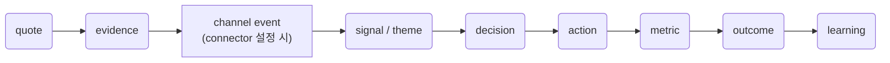

# Signal to Growth

> 고객 신호를 검증된 성장 행동으로<br>
> Turn customer evidence into measurable, human-approved growth actions.

[](https://github.com/kimsanguine/signal-to-growth/actions/workflows/ci.yml)
[](LICENSE)
[](https://agentskills.io/)
[](https://code.claude.com/docs/en/plugins)
[](https://github.com/openai/plugins)
[](#14개-스킬)
[](#artifact-contract)

**성장 프롬프트 모음이 아닙니다.** 고객 인용문에서 결과까지의 참조 무결성과
사람 승인 경계를 파일로 강제하는 작은 운영 체계입니다.

**그럼 무엇인가.** 14개 스킬이 주고받는 산출물을 22개 JSON Schema로 고정한
운영 체계입니다. 인용문에는 원문 파일·줄 위치를, 지표에는 baseline과
counter-metric을 필수 필드로 요구하고, 원장은 고쳐 쓰면 드러나는 해시 체인으로
잇습니다. 발송·게시·배포·삭제·환불은 `policies/default-policy.json`이 기본으로
막습니다. 근거가 없으면 그럴듯한 값으로 채우지 않고 그 자리에서 멈춥니다.
고객 인터뷰·CS·행동 지표에서 얻은 신호가 입력이고, 사람이 승인한 성장 결정과
콘텐츠·첫 사용자 루프·측정이 출력입니다.

- 하나의 `skills/` 소스에 **14개 스킬**이 있고, Claude Code와 OpenAI Codex가
  각자의 manifest로 같은 소스를 참조합니다. 다만 런타임이 제공하는 강제 수준은
  아직 동일하지 않습니다[^runtime-parity].
- 산출물은 대화 기억이 아니라 **22개 JSON Schema 계약**(`contracts/`)으로
  다음 단계에 연결됩니다.
- 발송·게시·배포·환불·삭제는 기본 정책에서 꺼져 있습니다
  (`policies/default-policy.json`의 `external_write_default: false`).
- 인용문에는 파일·줄 [locator](docs/glossary.md#locator-로케이터)가 필요하고, 합성 quote는 허용하지 않습니다
  (`allow_synthetic_quotes: false`).

**먼저 할 일 하나** — 파일을 바꾸지 않는 preview를 한 번 돌려보세요.
설치는 [아래 「설치」](#설치), 첫 실행은
[「첫 실행: Python 없이 preview부터」](#첫-실행-python-없이-preview부터)에 있습니다.

```text
/run-growth-loop
fixtures/public-dummy/artifacts를 학습 모드로 점검해줘. 파일은 바꾸지 마.
```

이 저장소는 아직 **릴리스 게이트를 통과하지 않았습니다.** 공개된 평가 점수와
남은 검증 범위는 [「프로젝트 상태」](#프로젝트-상태)에 그대로 적어 두었습니다.
[변경 이력](CHANGELOG.md)에서 release 단위의 차이를 확인할 수 있습니다.

**지금까지 실제로 확인된 것** (전체 목록과 근거는 [「프로젝트 상태」](#프로젝트-상태)):

- 271개 unit/integration test와 `validate-repo`·`validate-artifacts`·`demo` 통과
- Kakao Channel chatbot: Open Builder→Supabase 합성 E2E, 2026-08-06 실제 개발 채널 연결·skill test 왕복
- append-only 해시 체인, scoped human approval, 발송·게시·배포·삭제·환불 기본 차단
- **아직 안 된 것**: 30-case Claude Code·Codex 교차 런타임 평가, Production 승격, 실제 고객 인터뷰 승인(ICP 확정)

## 목차

> 처음 보는 단어가 나오면 [**용어집**](docs/glossary.md)을 보세요.
> `deterministic`·`locator`·`parity`·`idempotency`·`dedupe`·`state projection`·`WSGI`·`RLS` 등을
> 비개발 PM 기준으로 풀어 두었습니다.

**시작하기**

- [설치](#설치)
- [첫 실행: Python 없이 preview부터](#첫-실행-python-없이-preview부터)
- [5분 로컬 체험](#5분-로컬-체험)

**무엇을 하는가**

- [누구를 위한 것인가](#누구를-위한-것인가)
- [14개 스킬](#14개-스킬) · [목표 → 스킬 → 산출물](#목표--스킬--산출물)
- [실제 사용 예](#실제-사용-예) · [우리 저장소에 직접 적용해본 결과](#우리-저장소에-직접-적용해본-결과)
- [안전과 승인 경계](#안전과-승인-경계)
- [Artifact contract](#artifact-contract)

**왜 이렇게 만들었는가**

- [왜 만들었나](#왜-만들었나)
- [핵심 원칙](#핵심-원칙)
- [경쟁 제품과 다른 점](#경쟁-제품과-다른-점)

**참고**

- [CLI](#cli)
- [Claude Code와 Codex를 함께 지원하는 방식](#claude-code와-codex를-함께-지원하는-방식)
- [저장소 구조](#저장소-구조)
- [개발과 검증](#개발과-검증)
- [프로젝트 상태](#프로젝트-상태)
- [기여](#기여) · [출처와 감사](#출처와-감사) · [License](#license)

## 설치

### Claude Code

Claude Code 안에서 marketplace를 추가합니다.

```text
/plugin marketplace add kimsanguine/signal-to-growth
/plugin install signal-to-growth@signal-to-growth
/reload-plugins
```

그다음 자연어로 요청하거나 설치된 스킬을 지정합니다.

```text
이 인터뷰 3개를 원문 quote가 보존된 evidence로 합성해줘.
이 고객 신호를 바탕으로 첫 사용자 실험을 설계해줘.
```

설치 뒤에는 새 Claude Code 세션에서 `/run-growth-loop` preview를 한 번 실행합니다.
repository의 release 버전과 이미 설치된 plugin cache 버전은 별개일 수 있으므로,
preview 안내가 이 README의 six-part preview 목록
([「첫 실행: Python 없이 preview부터」](#첫-실행-python-없이-preview부터))과 다르면
`/plugin` 화면에서 설치된
`signal-to-growth` 버전을 확인하고 위 install/reload 순서를 다시 실행하세요.
이 확인은 Python 설치를 요구하지 않습니다. 자세한 첫 실행·복구 절차는
[학습자 시작 안내](docs/learner-start.md)를 봅니다.

### OpenAI Codex

터미널에서 marketplace를 추가합니다.

```bash
codex plugin marketplace add kimsanguine/signal-to-growth
```

Codex에서 `/plugins`를 열고 `signal-to-growth`를 설치한 뒤 새 세션을 시작합니다. 자연어로 요청하거나 `$skill-name`으로 특정 스킬을 선택할 수 있습니다.

```text
$synthesize-interviews 이 인터뷰를 evidence.jsonl로 합성해줘.
$run-growth-loop artifacts/를 검사하고 다음 단계를 알려줘.
```

### 범용 Agent Skills 설치

plugin을 지원하지 않는 환경이나 공통 설치가 필요하면 다음 경로를 사용할 수 있습니다.

```bash
npx skills add kimsanguine/signal-to-growth -a claude-code -a codex
```

플랫폼의 공식 plugin 설치가 1순위이며 범용 installer는 보조 경로입니다.

## 첫 실행: Python 없이 preview부터

Claude Code에서 skill을 설치하고 학습·preview 모드로 읽는 데 Python 3.11
설치를 선행할 필요는 없습니다. 첫 호출은 파일을 바꾸지 않고 AI 판단,
[deterministic](docs/glossary.md#deterministic-결정론적) 검증 상태, 사람 결정, 다음 skill을 분리합니다.

```text
/run-growth-loop

fixtures/public-dummy/artifacts를 학습 모드로 점검해줘.
파일을 바꾸지 말고 다음 skill 하나와 이유를 보여줘.
AI가 제안할 것, 사람이 결정할 것, 검증됨과 미확인을 분리해줘.
```

정상적으로 설치됐다면 preview 응답은 다음 **여섯 개 항목**을 라벨과 함께 돌려줍니다.
이 목록이 곧 설치 확인용 대조 기준입니다.

1. **읽은 입력(inputs read)** — 어떤 artifact·파일을 실제로 읽었는가
2. **모델 해석(model interpretation)** — AI가 그 입력을 어떻게 읽었는가
3. **결정론적으로 검증된 사실(deterministically verified facts)** — CLI·schema로 확인된 것
4. **미검증·차단된 사실(unverified or blocked facts)** — 확인하지 못했거나 막힌 것
5. **사람이 결정해야 할 항목(decisions that require a person)** — AI가 대신 정하지 않는 것
6. **제안된 파일 변경과 다음 skill 하나(proposed changes + next skill)** — 이유를 함께

여섯 항목 중 일부만 돌아오거나 라벨이 없다면 설치·버전 문제일 가능성이 큽니다.
[학습자 시작 안내](docs/learner-start.md)의 복구 절차를 따르세요.

미리보기를 검토한 뒤 별도의 다음 메시지에서 변경할 파일과 범위를 확인해야
`apply`로 전환합니다. Python CLI가 없거나 실행되지 않으면 해당 검증은
`not verified`로 남고 preview는 계속할 수 있습니다.

## 5분 로컬 체험

아래는 선택형 deterministic CLI 실습이며 Python 3.11 이상이 필요합니다.
설치 시 Draft 2020-12 계약 검증을 위한
`jsonschema` runtime dependency가 함께 설치됩니다.

```bash
git clone https://github.com/kimsanguine/signal-to-growth.git
cd signal-to-growth
python3 -m venv .venv
source .venv/bin/activate
python -m pip install -e .
signal-to-growth demo .
```

예상 결과:

```text
Demo validation passed: repository, contracts, references, and privacy.
```

공개 가능한 합성 인터뷰와 완성된 artifact chain은 `fixtures/public-dummy/`에 있습니다.

```bash
signal-to-growth validate-artifacts \
  fixtures/public-dummy/artifacts \
  --require-complete
```

## 누구를 위한 것인가

| 상황 | 적합도 |
|---|---|
| 고객 인터뷰·CS 신호가 쌓이는데 인용문 원문과 결론이 따로 논다 | 잘 맞음 |
| "이 결정을 왜 내렸는지" 나중에 설명해야 한다(투자자·사내 승인·강의 제출) | 잘 맞음 |
| Kakao·Naver 등 한국형 CS 채널을 자동으로 정규화하고 싶다 | 잘 맞음 |
| 그냥 빠르게 성장 아이디어 프롬프트만 필요하다 | **과잉일 수 있음** — 이 저장소는 근거·승인·schema 검증을 강제해 그만큼 느립니다 |
| 아직 고객 인터뷰가 0건이고 evidence로 연결할 신호 자체가 없다 | **과잉일 수 있음** — `synthesize-interviews`부터 시작할 원재료가 없으면 이 체계가 요구하는 절차가 오버헤드만 됩니다 |
| 목적이 발송·게시 자동화다 | **안 맞음** — 이 release는 모든 외부 실행을 기본 차단합니다([「안전과 승인 경계」](#안전과-승인-경계)) |

## 14개 스킬

| 순서 | 스킬 | 하는 일 | 핵심 산출물 |
|---:|---|---|---|
| 1 | `plan-customer-reach` | 조사 대상·채널·동의·draft-only 접촉 계획 | `reach-plan.json` |
| 2 | `run-switch-interview` | 실제 과거 행동 중심 Switch Interview 설계 | `interview-guide.md` |
| 3 | `synthesize-interviews` | quote·theme·반증을 evidence ID로 연결 | `evidence.jsonl` |
| 4 | `connect-customer-channels` | 한국형 CS event 검증·정규화·중복 제거·상태 대사 | `cs-events.jsonl` |
| 5 | `triage-customer-signals` | CS·review·survey 신호 정규화와 위험 분기 | `signals.jsonl` |
| 6 | `define-growth-metrics` | 분모·cohort·value event가 있는 지표 계약 | `metrics.jsonl` |
| 7 | `record-growth-decision` | 근거·대안·중단 조건·결과의 append-only 기록 | `decisions.jsonl` |
| 8 | `audit-answer-visibility` | SEO·GEO·AEO 표면의 날짜가 있는 관찰 감사 | `visibility-observations.jsonl` |
| 9 | `draft-evidence-content` | claim과 source를 연결한 answer-first 초안 | `claim-ledger.jsonl` |
| 10 | `osmu-fanout` | 승인된 content brief·claim ledger를 claim ID 추적 가능한 이미지 프롬프트·영상 스크립트로 재사용 | `visual-prompts.md`, `video-script.md` |
| 11 | `design-first-user-loop` | 첫 5명 직접 시딩과 가치 관찰에 집중하는 초기 사용자 실험 | `first-user-loop.json`, `experiment-cards.md` |
| 12 | `announce-release-to-customers` | 결정론적 변경 목록을 커밋·근거에 연결된 고객 언어 릴리스 노트로 번역 | `release-notes.jsonl` |
| 13 | `run-growth-loop` | artifact 상태와 승인에 따른 다음 스킬 routing | `run-state.json` |
| 14 | `optimize-search-visibility` | 웹사이트 SEO 랭킹·AI 답변엔진(GEO/AEO) 인용 가시성 감사·개선 | `geo-audit-report.md`, `llms.txt` |

`osmu-fanout`과 `announce-release-to-customers`는 2026-08-05에,
`optimize-search-visibility`는 2026-08-09에 추가됐고 셋 다
`src/signal_growth/repo_validation.py`의 `EXPECTED_SKILLS`에 반영돼
있습니다. `osmu-fanout`과 `announce-release-to-customers`는
`src/signal_growth/workflow.py`의 routing graph에도 있지만,
`optimize-search-visibility`는 의도적으로 빠져 있습니다 — 외부 사이트를
감사하는 리포트 스킬이라 growth loop 상태에 연결되지 않기 때문입니다
(`workflow.py`의 관련 주석 참고). 셋 다 강의 커리큘럼 매핑(아래 「강의
커리큘럼 × 스킬 × 산출물」)에는 아직 배치되지 않았습니다.

각 스킬은 독립적으로 사용할 수 있습니다. connector를 설정하지 않으면 기존 manual signal flow를 그대로 사용합니다. `run-growth-loop`는 전문 스킬의 판단을 대신하지 않고 상태와 handoff만 관리합니다.

### 목표 → 스킬 → 산출물 → 그 산출물을 붙잡아 두는 것

스킬 이름을 모르는 상태로 들어왔다면 이 표부터 보세요. 왼쪽에서 지금 하려는
일을 찾으면 어떤 스킬을 어떤 순서로 부를지가 정해집니다.

네 번째 열이 이 표의 핵심입니다. 앞선 세 열만 있으면 이 저장소는 "스킬이
파일을 만들어 준다"는 흔한 약속과 구분되지 않습니다. 네 번째 열은 각 산출물이
**무엇으로 검증되고 무엇이 없으면 진행이 멈추는지**를 적습니다. 모두 파일에서
직접 확인할 수 있고, 셀마다 근거 파일을 함께 적어 두었습니다.

한 가지를 구분해 적었습니다. **코드·schema가 실행 중에 막는 것**과 **정책
문서가 선언만 한 것**은 강제력이 다릅니다. 후자에 해당하는 항목은 그렇다고
표시했습니다. 이 구분을 흐리면 이 표 자체가 이 저장소가 하지 말라고 하는
"검증된 것과 안 된 것 섞어 적기"가 됩니다.

| 목표 (Goal) | 스킬 (Skills) | 산출물 (Output) | 근거 규율 (Discipline) — 무엇이 검증하나 / 무엇이 없으면 멈추나 |
|---|---|---|---|
| 누구를 만날지 정하고 동의를 받은 상태로 접촉하고 싶다 | `plan-customer-reach` | `reach-plan.json`, `contact-drafts.md` | 계획이 완성돼도 발송은 일어나지 않습니다. 승인 목록(`email`·`direct_message`)에 있을 뿐 아니라 **이 release에는 외부 발송 경로 자체가 없습니다** — `adapters/base.py`의 `send_approved`는 언제나 예외를 던집니다 |
| 첫 인터뷰를 인상이 아니라 근거로 바꾸고 싶다 | `run-switch-interview` → `synthesize-interviews` | `interview-guide.md` → `evidence.jsonl`, `counterevidence.md` | quote마다 `locator.file`이 필수이고, CLI가 **그 위치에 원문이 실제로 있는지 대조**합니다. `strength`를 `awaiting_human_tag` 위로 올리려면 `approved_by`가 있어야 합니다(`src/signal_growth/contracts.py`). 합성 quote는 금지 |
| 쌓인 CS·리뷰·설문을 분류하고 고위험 건을 따로 빼고 싶다 | `triage-customer-signals` | `signals.jsonl`, `risk-queue.jsonl` | `signal.schema.json`으로 검증하고, `signals.jsonl`은 append-only 해시 체인이라 뒤늦게 고쳐 쓰면 대사에서 드러납니다 |
| 카카오·네이버·Channel Talk의 CS를 자동으로 정리하고 싶다 | `connect-customer-channels` → `triage-customer-signals` | `channel-connection.json`, `cs-events.jsonl` → `signals.jsonl` | 검증 수준이 `none`인 event는 정규화까지 가지 못하고 `PolicyViolation`으로 멈춥니다 — 상수가 아니라 `policies/default-policy.json`의 `blocked_verification_assurance`가 정하고, `tests/test_policy.py`가 이 연결이 끊기면 실패합니다. `fixture-validated`·`test-account verified`·`production-operational`은 **섞어 적지 않습니다** |
| "활성 사용자"처럼 애매한 지표에 분모와 cohort를 붙이고 싶다 | `define-growth-metrics` | `metrics.jsonl`, `measurement-plan.md` | `baseline`과 `counter_metric_ids`가 `metric.schema.json`의 필수 필드라, 모르면 비워 두는 게 아니라 모른다고 적어야 합니다. "출처 없는 업계 벤치마크 금지"는 *정책 선언*이며 schema 검사로는 잡히지 않습니다 |
| 무엇을 만들지 **않기로** 했는지를 근거와 함께 남기고 싶다 | `record-growth-decision` | `decisions.jsonl`, `decision-summary.md` | append-only 해시 체인이라 결정 당시의 근거를 나중에 결과에 맞춰 손볼 수 없습니다. Claude Code에서는 훅이 덮어쓰기를 도구 수준에서 차단합니다[^runtime-parity] |
| AI 검색·생성형 답변에 우리 페이지가 잡히는지 확인하고 싶다 | `audit-answer-visibility` | `visibility-observations.jsonl`, `citation-gaps.md`, `technical-findings.md` | 관찰마다 날짜와 접근 상태가 필요합니다. 확인하지 못한 표면은 낮은 점수가 아니라 `unknown`으로 남고, 진단 점수를 쓸 때는 가중치를 공개하고 heuristic이라고 라벨해야 합니다 |
| AEO 콘텐츠를 쓰되 문장마다 출처를 남기고 싶다 | `audit-answer-visibility` → `draft-evidence-content` | `citation-gaps.md` → `claim-ledger.jsonl`, `draft.md` | 주장마다 출처와 claim state를 `claim-ledger.schema.json`에 맞춰 원장에 남깁니다. 초안이 완성돼도 게시로 넘어가지 않습니다 — `publish`가 승인 목록에 있고, 이 release에는 게시 경로가 구현돼 있지 않습니다 |
| 첫 5명을 직접 시딩하고, 이후 소개·추천 가능성을 검증하고 싶다 | `design-first-user-loop` → `define-growth-metrics` → `record-growth-decision` | `first-user-loop.json` → `growth-loop-map.md` → `decisions.jsonl` | 첫 5명은 `capacity`와 `stop_condition` 안에서만 관찰합니다. 이후 소개는 qualified introduction·첫 가치·재사용을 별도 측정하고, HOLD·재개·보상 선택을 결정 로그에 남깁니다. 게시·발송은 일어나지 않습니다 |
| 지금 어디까지 왔고 다음에 뭘 해야 하는지 모르겠다 | `run-growth-loop` | `run-state.json`, `next-action.md`, `blocked-items.md` | 선행 산출물이 계약을 통과해야 다음 스킬을 제안합니다. 통과하지 못하면 건너뛰지 않고 막힌 이유를 `blocked-items.md`에 적고 멈춥니다 |

표를 읽는 법 두 가지.

- **네 번째 열이 비어 있는 행은 없습니다.** 어떤 목표로 들어오든 근거·승인·계약
  중 하나가 걸립니다. 이것이 이 저장소가 프롬프트 모음과 갈리는 지점이고,
  동시에 이 도구를 쓰는 비용이기도 합니다 — 근거가 없으면 결과물도 안 나옵니다.
- **이 표가 정하지 않는 것.** 어떤 고객을 목표 고객(ICP)으로 확정할지, 어떤
  기회에 투자할지는 사람이 정합니다. 표의 책임은 "그 판단에 필요한 근거를 어떤
  파일에 어떤 검증을 걸어 남기는가"까지입니다.

### 강의 커리큘럼 × 스킬 × 산출물

강의를 따라오는 경우 아래 매핑으로 "지금 어느 스킬을 쓰는가"를 확인할 수 있습니다.

| 커리큘럼 | 스킬 | 산출물 |
|---|---|---|
| 01-01 고객 접촉 계획 | `plan-customer-reach` | `reach-plan.json`, `contact-drafts.md`, `recruitment-log.csv` |
| 01-02 인터뷰 설계와 증거화 | `run-switch-interview` → `synthesize-interviews` | `interview-guide.md` → `evidence.jsonl`, `counterevidence.md` |
| 02-01 신호 분류와 고위험 처리 | `triage-customer-signals` | `signals.jsonl`, `risk-queue.jsonl`, `dead-letter.jsonl` |
| 02-02 한국형 CS 채널 연결 | `connect-customer-channels` | `channel-connection.json`, `cs-events.jsonl`, `connector-state.json` |
| 03-01 지표 계약 | `define-growth-metrics` | `metrics.jsonl`, `measurement-plan.md` |
| 03-02 성장 결정 기록 | `record-growth-decision` | `decisions.jsonl`, `decision-summary.md` |
| 04-01 답변 가시성 감사 | `audit-answer-visibility` | `visibility-observations.jsonl`, `citation-gaps.md`, `technical-findings.md` |
| 04-02 근거 기반 콘텐츠 초안 | `draft-evidence-content` | `claim-ledger.jsonl`, `draft.md`, `review-checklist.md` |
| 05-01 첫 사용자 루프 설계 | `design-first-user-loop` | `first-user-loop.json`, `experiment-cards.md` |
| 05-02 승인 경계 아래의 실행 | `design-first-user-loop` → `draft-evidence-content` | `first-user-loop.json` → `content-brief.json`, `claim-ledger.jsonl`, `approvals.jsonl` |
| 전 구간 (오케스트레이션) | `run-growth-loop` | `run-state.json`, `next-action.md`, `blocked-items.md` |

두 가지를 분명히 해 둡니다.

- **05-02는 새 스킬이 아닙니다.** 12번째 스킬을 만들지 않고
  `design-first-user-loop` → `draft-evidence-content` 라우팅 간선만 추가했습니다.
  이 간선은 구현돼 있으며, 검증된 first-user loop가 완료된 뒤에만 콘텐츠 분기가
  열립니다(`src/signal_growth/workflow.py`의 `CONTENT_PREREQUISITE`).
- `approvals.jsonl`은 **사람이 승인한 뒤에만** 생성됩니다. 스킬이 스스로
  만들지 않습니다.
- 클립 번호 중 01-01, 04-01, 04-02, 05-01, 전 구간 행은 저장소 문서에 번호 기록이
  없어 스킬 순서와 산출물 의존 관계로 배치한 **제안**입니다. 나머지 행은
  [Korean CS integration plan](docs/v2-korean-cs-integration-plan.md)에 근거가 있습니다.
  산출물 이름의 정본은 각 `skills/<name>/references/output-contract.md`입니다.

> **연동 문서를 쓰기 전에**: `verify_event`·`normalize_event`의 실제 시그니처는 항상
> [`src/signal_growth/adapters/base.py`](src/signal_growth/adapters/base.py)의
> `ChannelAdapter` Protocol이 유일한 정답입니다. 교안·튜토리얼·타 문서에 의사코드를 적을 때
> 이 파일과 대조하지 않으면 시그니처 드리프트가 생깁니다(실제로 한 번 발생해 발견·수정함).

## 실제 사용 예

### 1. 인터뷰 합성

```text
$synthesize-interviews

fixtures/public-dummy/interviews/에 있는 합성 인터뷰를 읽고
quote와 해석을 분리한 evidence.jsonl을 만들어줘.
반증과 distinct participant 수도 별도로 보여줘.
```

완료 전에 확인할 것:

- quote가 원문과 일치하는가;
- file·line locator가 있는가;
- 여러 quote를 여러 사람으로 잘못 계산하지 않았는가;
- strength가 사람 승인 전 `awaiting_human_tag`인가;
- observed와 inferred가 구분되는가.

### 2. 지표 계약

```text
$define-growth-metrics

첫 evidence-backed decision을 activation 후보로 검토해줘.
entity, population, numerator, denominator, cohort maturity,
counter-metric을 포함하고 baseline은 모르면 null로 남겨줘.
```

### 3. 첫 사용자 루프

```text
$design-first-user-loop

승인된 evidence와 metric을 바탕으로 5팀 규모의 첫 사용자 실험을 설계해줘.
메시지는 초안까지만 만들고 실제 발송은 하지 마.
```

### 우리 저장소에 직접 적용해본 결과

이 도구를 남에게 권하기 전에 우리 자신에게 먼저 적용했습니다. `audit-answer-visibility`와
`draft-evidence-content`로 이 저장소의 README·문서·manifest를 감사했고, 그때 나온
산출물을 요약하지 않고 [`docs/self-marketing/`](docs/self-marketing/)에 그대로 두었습니다.

- [`visibility-observations.jsonl`](docs/self-marketing/visibility-observations.jsonl) — 날짜와 접근 상태가 붙은 관찰 기록
- [`technical-findings.md`](docs/self-marketing/technical-findings.md) — `not checked`와 `not present`를 구분한 기술 점검표
- [`claim-ledger.jsonl`](docs/self-marketing/claim-ledger.jsonl) — 마케팅 문장마다 붙인 출처와 claim 상태
- [`recommendations.md`](docs/self-marketing/recommendations.md) — 채택하지 **않기로** 권고한 항목 포함

읽는 사람에게 유리한 부분만 남기지 않았습니다. 감사 결과 `llms.txt`가 없었고, 질문형
헤딩이 31개 중 1개였고, 구조화 데이터가 0건이었다는 사실이 그대로 적혀 있습니다.
라이브 관찰이 0건이라 점수를 매기지 않은 이유도 함께 적었습니다. 이 산출물들이
실제 계약을 지키는지는 [`tests/test_self_marketing_artifacts.py`](tests/test_self_marketing_artifacts.py)가 검사합니다.

## 안전과 승인 경계

기본 정책은 [`policies/default-policy.json`](policies/default-policy.json)에 있습니다.

다음 작업은 어떤 스킬도 자동 승인하지 않습니다.

- email 또는 direct message 발송
- 외부 게시
- 광고비·incentive·환불 등 비용 발생
- 고객 약속
- 데이터 삭제
- 배포
- 계정·billing 변경

외부 실행에는 최소한 다음 항목이 필요합니다.

1. 명시적 사람 승인
2. 구체적인 대상과 owner
3. 검증된 action artifact
4. audit record

보안·데이터 신고는 [SECURITY.md](SECURITY.md)를 확인하세요.

## Artifact contract

Core JSON Schema:

| 객체 | Schema | ID |
|---|---|---|
| Evidence | [`evidence.schema.json`](contracts/evidence.schema.json) | `EV-YYYYMMDD-NNN` |
| Signal | [`signal.schema.json`](contracts/signal.schema.json) | `SIG-YYYYMMDD-NNN` |
| Metric | [`metric.schema.json`](contracts/metric.schema.json) | `MET-YYYYMMDD-NNN` |
| Decision | [`decision.schema.json`](contracts/decision.schema.json) | `DEC-YYYYMMDD-NNN` |
| Action | [`action.schema.json`](contracts/action.schema.json) | `ACT-YYYYMMDD-NNN` |
| Outcome | [`outcome.schema.json`](contracts/outcome.schema.json) | `OUT-YYYYMMDD-NNN` |
| Run state | [`run-state.schema.json`](contracts/run-state.schema.json) | `RUN-YYYYMMDD-NNN` |

Connector JSON Schema:

| 객체 | Schema |
|---|---|
| Channel connection | [`channel-connection.schema.json`](contracts/channel-connection.schema.json) |
| Canonical CS event | [`cs-event.schema.json`](contracts/cs-event.schema.json) |
| Reply draft | [`reply-draft.schema.json`](contracts/reply-draft.schema.json) |
| Delivery event | [`delivery-event.schema.json`](contracts/delivery-event.schema.json) |
| Connector state | [`connector-state.schema.json`](contracts/connector-state.schema.json) |

상세 연결 규칙은 [Artifact contracts](docs/artifact-contracts.md)를 확인하세요.

## 왜 만들었나

초기 SaaS 팀은 고객 신호가 부족해서만 실패하지 않습니다.

- 인터뷰 원문과 요약이 분리됩니다.
- CS 태그와 실제 고객 맥락이 달라집니다.
- 지표 이름은 있지만 분모·cohort·value event가 없습니다.
- 결정 당시 근거와 실행 후 결과가 연결되지 않습니다.
- AI가 만든 초안과 사람이 승인한 실행의 경계가 흐려집니다.

Signal to Growth는 이 연결을 하나의 artifact lineage로 관리합니다.



이 저장소는 “성장 prompt를 많이 제공하는 catalog”가 아닙니다. 증거 계보, 승인 상태, 설정 가능한 지표 정책, 실패 시 중단 조건을 제공하는 작은 운영 체계입니다.

## 핵심 원칙

1. **Evidence before advice** — 권고보다 원문·출처·관찰 시점을 먼저 남깁니다.
2. **AI proposes, human decides** — AI는 추출·분류·초안을 담당하고 중요한 판단과 외부 실행은 사람이 승인합니다.
3. **Policy over universal thresholds** — 인터뷰 수, retention target, 위험 기준을 보편값으로 고정하지 않습니다.
4. **Draft is not execution** — 메시지·콘텐츠 초안과 발송·게시를 분리합니다.
5. **One source, two adapters** — 공통 스킬을 유지하고 플랫폼별 manifest만
   분리합니다. 다만 런타임이 제공하는 안전장치는 아직 동일하지 않습니다[^runtime-parity].
6. **Artifacts connect skills** — 대화 기억보다 JSON·JSONL·Markdown 산출물로 다음 단계를 연결합니다.
7. **Fail loud** — 근거·동의·schema·승인이 부족하면 이유를 남기고 멈춥니다.

[^runtime-parity]: append-only 산출물의 덮어쓰기를 차단하는 PreToolUse 훅은
현재 Claude Code에만 구현돼 있습니다(`hooks/hooks.json`). Codex에서는 같은
규칙이 `SKILL.md`의 지시와 `append-record` CLI로만 유지되며, 도구 수준의
강제는 아직 없습니다(`.codex-plugin/plugin.json`에 hooks 키 없음). Codex 대응은
진행 중입니다. 두 런타임의 30-case 호출 [parity](docs/glossary.md#parity-동등성) 역시 미검증 상태입니다
([Evaluation summary](eval/summary.md)). 승인 경계·정책·schema 검증은 두 런타임
공통이며, 차이는 훅이라는 한 층입니다.

## CLI

CLI는 AI 판단을 대신하지 않습니다. schema, reference, privacy pattern, 질문 위험, workflow 상태처럼 결정론적으로 확인할 수 있는 부분을 담당합니다.

### 두 가지 호출 형식은 같은 CLI입니다

이 저장소에는 CLI를 부르는 방식이 두 개 있고, **둘 다 같은 진입점(`signal_growth.cli:main`)을 실행합니다.** 어느 쪽을 쓰든 결과는 동일합니다.

| 형식 | 조건 | 주로 쓰는 곳 |
|---|---|---|
| `signal-to-growth <명령>` | `pip install -e .`로 패키지를 설치했고 venv가 활성화된 상태 | 이 README의 예시, 일상적인 로컬 사용 |
| `python3 scripts/stg.py <명령>` | 설치 없이 저장소 checkout만 있는 상태 | 14개 `SKILL.md`의 검증 지시, CI, `CLAUDE.md`의 검증 절차 |

`scripts/stg.py`는 `src/`를 `sys.path`에 넣고 같은 `main()`을 호출하는 얇은 wrapper입니다. `SKILL.md`가 wrapper 형식을 쓰는 이유는, skill을 읽는 학습자·에이전트가 패키지를 설치했는지 보장할 수 없기 때문입니다. 설치를 마쳤다면 `signal-to-growth`가 짧고, 설치 전이거나 다른 사람의 환경을 재현하는 중이라면 `python3 scripts/stg.py`가 항상 동작합니다.

### 저장소 검사

```bash
signal-to-growth validate-repo .
```

검사 범위:

- 14개 스킬 존재 여부
- portable frontmatter
- skill 이름과 폴더 일치
- `agents/openai.yaml`
- output contract reference
- Claude·Codex manifest
- 남아 있는 placeholder

### artifact 검사

```bash
signal-to-growth validate-artifacts artifacts/
```

`--require-complete`를 사용하면 다음 7개 core artifact를 모두 요구합니다.

- `evidence.jsonl`
- `signals.jsonl`
- `metrics.jsonl`
- `decisions.jsonl`
- `actions.jsonl`
- `outcomes.jsonl`
- `run-state.json`

validator는 ID 형식, 필수 필드, 승인 상태, 외부 실행 승인, evidence→decision→action→metric→outcome 참조를 확인합니다.

Connector를 사용하는 run은 5개 추가 contract를 사용합니다.

- `channel-connection.json`
- `cs-events.jsonl`
- `reply-drafts.jsonl`
- `delivery-events.jsonl`
- `connector-state.json`

```bash
signal-to-growth validate-connectors artifacts/
signal-to-growth normalize-event \
  --provider kakao-openbuilder \
  --request-id request-public-dummy-001 \
  --input fixtures/public-dummy/providers/kakao-openbuilder/skill-request.json
```

`normalize-event`는 로컬 payload만 처리하며 provider network에 연결하거나 답변을 발송하지 않습니다.

### PMF Radar import와 hplan intake

PMF Radar의 normalized export는 기본적으로 dry-run 검증만 합니다.

```bash
signal-to-growth import-pmf-radar \
  --input fixtures/public-dummy/integrations/pmf-radar/stg-export.jsonl
```

검증된 이벤트를 artifact directory에 쓰려면 `--write`를 명시합니다.
이 단계는 `cs-events.jsonl`과 source reference만 만들며 interview evidence나
customer signal을 자동 추론하지 않습니다.

승인된 growth decision은 hplan의 Build Gate 입력 초안으로 변환할 수 있습니다.

```bash
signal-to-growth export-hplan \
  --artifacts fixtures/public-dummy/artifacts \
  --product-name "Signal to Growth demo" \
  --jtbd "고객 근거를 다음 성장 결정으로 연결한다" \
  --functional-requirement "source-linked decision intake 생성"
```

출력의 `hplan_gate_decision`은 항상 `null`입니다. Signal to Growth는 hplan의
gate 통과나 구현 가능성을 대신 판정하지 않습니다. 계약과 상태 전이는
[PMF Radar and hplan integration](docs/integrations/pmf-radar-hplan.md)에
정리했습니다.

### 한국형 CS 지원 수준

| 표면 | 현재 구현 | 아직 검증하지 않은 것 |
|---|---|---|
| Kakao Channel chatbot | Open Builder 요청 정규화·마스킹·중복 제거, Supabase restricted sink, Vercel Preview→Supabase 합성 E2E, live [idempotency](docs/glossary.md#idempotency-멱등성), `version=2.0` 응답, Chatbot Admin Center 개발 채널 연결과 skill test 왕복(2026-08-06) | 동일 발화를 개발 채널에서 2회 보냈을 때 서로 다른 `X-Request-Id`가 생성되는지, Production |
| Naver TalkTalk | public dummy event 정규화·마스킹·중복 제거 | 실제 test account webhook, backfill, 발송 |
| Channel Talk | webhook 정규화와 injected read-only backfill·대사 | 실제 credential·HTTPS endpoint 왕복 |
| Kakao 상담톡 via Channel Talk | product boundary와 계정 설정 절차 | 실제 채널 이관·상담 event |
| Happytalk | 공식 규격 reference와 public dummy fixture | credential 기반 adapter |
| Kakao 공식 딜러 | accepted/delivered 상태 fixture와 state projection | 선택된 딜러의 simulator·callback·polling |

`fixture-validated`, `test-account verified`, `production-operational`을 서로 다른 상태로 기록합니다.

강의 핵심 E2E는 `Kakao Channel chatbot through Kakao i Open Builder`입니다.
Channel Talk는 Open API key 발급에 유료 plan이 필요한 선택형 connector로
유지하며, 강의 본편에서는 구조와 확장 경로만 소개합니다. Kakao chatbot
skill request는 상담톡이나 native 1:1 상담 이력 API가 아닙니다.

`KakaoSkillApplication`은 정규화 event를 먼저 저장한 뒤 fixed
`version=2.0` 응답을 반환하는 deployment-neutral [WSGI](docs/glossary.md#wsgi) application입니다.
`app.py`는 Vercel entry point, `SupabaseEventSink`는 server-only secret을
사용하는 저장 adapter입니다. 저장 실패 시 성공 응답을 반환하지 않습니다.
승인 참조는 canonical 고객 event와 분리된 `approval_ref` 열에 저장합니다.
공개 root route는 secret이나 설정 상태 대신 문서·health route만 반환합니다.

### Kakao test endpoint 배포

Kakao Developers API key는 사용하지 않습니다. Open Builder skill header와
서버가 공유할 임의의 `x-api-key` 하나와 고객 식별자 HMAC용 별도 secret을
생성합니다. 두 값과 Supabase secret key는 repository나 채팅에 입력하지
않고 Vercel Environment Variables에 저장합니다. Kakao shared key의 복구
사본만 운영자 password manager에 보관합니다.

필수 환경 변수 이름은 [`.env.example`](.env.example)에 있습니다.

```text
KAKAO_SKILL_API_KEY
STG_CUSTOMER_HMAC_KEY
STG_APPROVAL_REF
SUPABASE_URL
SUPABASE_SECRET_KEY
```

다음 두 값은 기본값이 있지만, 검증 환경에서는 의도를 고정하기 위해 함께
등록했습니다.

```text
STG_PROCESSING_BASIS_REF
SUPABASE_KAKAO_EVENTS_TABLE
```

1. 별도의 Supabase test project에서 `supabase/migrations/`의 migration을
   순서대로 적용합니다.
2. Vercel project에 필수 환경 변수를 server-side secret으로 등록합니다.
3. preview를 배포하고 `GET /api/health`가 `status=configured`인지 확인합니다.
4. 합성 Kakao payload를 `POST /api/kakao/skill`로 보내 `version=2.0`을 확인합니다.
5. Supabase에서 같은 `event_id`가 한 행만 저장됐는지 확인합니다.
6. Kakao Chatbot Admin Center의 skill URL과 test header를 등록한 뒤 개발 채널에서 왕복을 확인합니다.

2026-07-26 기준 1~5단계는 격리된 Supabase test project와 Vercel
Preview에서 실제로 검증했습니다. `health=200/configured`, 잘못된
`x-api-key=401`, 정상 합성 요청 두 회 모두 `200/version=2.0`, 같은
`X-Request-Id`의 저장 행은 한 건이었습니다. 6단계인 Kakao 개발 채널
연결과 skill test 왕복은 2026-08-06에 실제 개발 채널에서 검증했습니다
(`event_id=CSE-cdcb93c608f7abd2acb47920b267ae51`, `auth_verified=true`,
dead-letter 0건 유지). 동일 발화를 그 채널에서 2회 보냈을 때 서로 다른
`X-Request-Id`가 생성되는지는 아직 별도 검증 대상입니다. 실행 증거와 남은
경계는 [Verification](docs/verification.md)과
[Provider setup checklist](docs/provider-setup-checklist.md)에 기록합니다.

이 table은 [RLS](docs/glossary.md#rls-row-level-security-행-수준-보안)를 활성화하고 `anon`·`authenticated` 권한을 제거하며,
두 browser role에 명시적인 deny policy도 적용합니다.
`sb_secret_...` key는 backend 전용이며 브라우저나 교안에 노출하지 않습니다.
실제 고객 데이터가 아닌 합성 발화만 사용합니다.
`STG_APPROVAL_REF`에는 secret이나 자유 서술 대신 `APR-KAKAO-TEST-001` 같은
비민감 승인 record ID를 사용합니다. 각 행의 `expires_at`은 7일 뒤를
가리키지만 자동 삭제 작업은 아닙니다. 삭제 절차와 승인 경계는
[Kakao test retention runbook](docs/operations/kakao-test-retention.md)을
따릅니다.

### 개인정보 pattern 검사

```bash
signal-to-growth scan-privacy path/to/file.md
```

현재 email, 한국 휴대전화, 국제 전화, 일부 API key, JWT pattern을 찾습니다. 결과는 유형과 줄 번호만 출력하며 발견한 값을 다시 출력하지 않습니다.

이 검사는 완전한 DLP가 아닙니다. 민감 데이터는 입력 전에 승인된 저장·처리 정책을 적용해야 합니다.

### 인터뷰 질문 검사

```bash
signal-to-growth lint-questions interview-guide.md
```

설정된 leading, hypothetical, solution-first, compound question pattern을 찾습니다. 결과는 검토 단서이며 인터뷰 품질의 자동 판정이 아닙니다.

### 다음 단계 확인

```bash
signal-to-growth next-step artifacts/
```

artifact가 준비된 순서를 기준으로 첫 누락 스킬과 완료된 스킬을 JSON으로 반환합니다. `reason` 필드에 왜 그 스킬이 다음인지 사람이 읽는 한 문장이 함께 나옵니다.

## Claude Code와 Codex를 함께 지원하는 방식

```text
skills/                         공통 source of truth
├── <skill>/SKILL.md
├── <skill>/references/
└── <skill>/agents/openai.yaml

.claude-plugin/                 Claude Code adapter
.codex-plugin/                  Codex adapter
.agents/plugins/                Codex marketplace
```

- 공통 `SKILL.md`는 [Agent Skills open standard](https://agentskills.io/)를 따릅니다.
- Claude Code는 `.claude-plugin/plugin.json`을 사용합니다.
- Codex는 `.codex-plugin/plugin.json`을 사용합니다.
- 플랫폼별 manifest가 skill 행동을 복제하지 않습니다.
- release metadata를 바꾸면 두 manifest와 두 marketplace를 함께 갱신합니다.

설계 근거는 [Architecture](docs/architecture.md)에 있습니다.

## 저장소 구조

```text
signal-to-growth/
├── .agents/plugins/marketplace.json
├── .claude-plugin/
├── .codex-plugin/
├── app.py
├── contracts/
├── docs/
├── fixtures/
│   ├── negative/
│   └── public-dummy/
├── policies/
├── scripts/
├── skills/
├── supabase/migrations/
├── src/signal_growth/
└── tests/
```

## 개발과 검증

```bash
python3 -m venv .venv
source .venv/bin/activate
python -m pip install -e ".[dev]"
make check
```

선택 의존성이 하나 있습니다. `audit-answer-visibility`가 진단용 citability 점수를
쓸 때만 필요하고, 설치하지 않으면 해당 항목이 `unknown`으로 남을 뿐 나머지 감사는
그대로 동작합니다. 연결 지점은 [`src/signal_growth/geo_visibility.py`](src/signal_growth/geo_visibility.py) 한 곳입니다.

```bash
python -m pip install -e ".[geo]"
```

점수는 그 외부 패키지가 계산한 heuristic이며 이 저장소가 재계산하거나 재척도하지
않습니다. 인용될 확률로 읽지 마세요.

개별 skill은 공식 `quick_validate.py`로도 검사합니다.

```bash
python3 /path/to/skill-creator/scripts/quick_validate.py \
  skills/synthesize-interviews
```

검증 층위:

1. **Static** — frontmatter, manifest, schema, link
2. **Trigger** — 맞는 요청과 잘못된 요청의 skill 선택
3. **Output** — artifact contract와 claim state
4. **Adversarial** — fabricated quote, PII, unapproved send, invalid reference
5. **Integration** — evidence에서 outcome까지 연결
6. **Cross-runtime** — Claude Code와 Codex의 핵심 artifact 비교

현재 release에서 자동화한 범위와 남은 runtime 검증은 [Verification](docs/verification.md)에 기록합니다.
평가 점수와 릴리스 판정은 한곳에만 두었습니다 — [「프로젝트 상태」](#프로젝트-상태)를 보세요.
점수 하나만 보고 준비도를 과대평가하지 않도록, 그 섹션에 공개된 두 점수를 함께 적어 두었습니다.
평가 범위와 원점수는 [Skill evaluation plan](docs/skill-evaluation-plan.md)과
[Evaluation summary](eval/summary.md)에 기록합니다.
현재 branch 상태, 재개 명령, 승인 필요 항목은
[Continuation handoff](docs/HANDOFF.md)를 먼저 확인하세요.

## 경쟁 제품과 다른 점

범용·도메인 skill 저장소 18개를 비교했습니다. 자세한 조사와 채택·배제 판단은 [Competitive landscape](docs/competitive-landscape.md)에 있습니다.

Signal to Growth가 집중하는 공백:

- 인터뷰 quote에서 outcome까지의 reference integrity
- AI 제안과 사람 승인의 분리
- fixed benchmark 대신 project policy
- 초안과 실제 external write의 분리
- 한 source에서 Claude Code·Codex로 배포 (런타임별 강제 수준은 아직
  다릅니다[^runtime-parity])
- positive·negative·integration fixture를 함께 제공

## 프로젝트 상태

`v0.4.0`은 수강생용 preview/apply 경계, outcome-aware routing, scoped
human approval, Bash overwrite guard를 추가한 release candidate입니다.

**릴리스 게이트: `HOLD / NO-GO`.** 판정 근거와 원점수는
[Evaluation summary](eval/summary.md), 판정 기준은
[Skill evaluation plan](docs/skill-evaluation-plan.md)에 있습니다.

이 저장소가 스스로 내린 gate 판정의 전체 기록은
[**Decision log**](docs/decision-log.md)에 있습니다. append-only 원장인
`harness/decisions.jsonl`을 렌더링한 문서이며, 각 판정의 근거·재검토 조건과
아직 관측되지 않은 결과를 분리해 보여줍니다.

### 평가 점수를 두 개 공개하는 이유

두 점수는 개선 전후 쌍이 아니고, 어느 쪽도 다른 쪽을 대체하지 않습니다.
**서로 다른 대상을, 서로 다른 근거 기준으로** 채점했습니다.

| | 67 / 100 | 49.2 / 100 |
|---|---|---|
| snapshot | `fe3dfc4` | `8aef638` |
| 채점 대상 | 저장소에 쓰인 것 | 그 시점에 실제로 증명 가능한 근거 |
| 평가자 | 5개 독립 관점 | 5개 새 Codex 컨텍스트 |
| 개별 점수 분포 | 46–79 | 30–81 |
| 판정 | `NO-GO` | `HOLD / NO-GO` |

deterministic hardening이 반영되고 회귀 테스트를 통과한 뒤에 점수가 **내려간**
것은 이상한 결과가 아닙니다. 두 번째 평가는 쓰인 것이 아니라 증명 가능한 것을
채점했고, 그 사이에 평가자가 요구한 근거 기준이 올라갔기 때문입니다. 생성
artifact E2E, 실제 plugin 설치, provider 운영, Claude Code·Codex parity가 모두
미검증이라 해당 항목은 "없음"이 아니라 **"입증되지 않음"**으로 채점됐습니다.

두 점수 모두 runtime 결과가 아닙니다. 정식 30-case 교차 런타임 평가는 아직
완료되지 않았습니다 — Codex batch는 끝났지만 Claude Code batch가 계정 지출
한도(HTTP 429)로 중단됐습니다. hardening 작업, 통과한 테스트 스위트, 머지된
기본 브랜치를 더 높은 점수로 읽지 마세요. release tag, Production 승격,
provider 운영, 외부 write는 모두 미승인 상태입니다.

`GO` 판정은 [판정 기준](docs/skill-evaluation-plan.md) 6개 조건이 **전부**
충족될 때만 나옵니다(hard-gate 실패 0건, deterministic artifact 검증 100%,
전체 task 성공률 85% 이상, 핵심 스킬 각 80점 이상, cross-runtime semantic
parity 90% 이상, ICP 확정). 마지막 조건의 입력인 실제 고객 인터뷰가 사람 승인
대기 상태이므로, 점수와 무관하게 현재 `GO`는 도달 불가입니다.

포함:

- 14개 portable skill
- Claude Code·Codex plugin manifest
- `contracts/`의 22개 JSON Schema 계약 — core artifact, scoped approval,
  first-user-loop, connector, claim ledger, visibility observation, gate decision
- 전체 Draft 2020-12 schema와 exact evidence locator를 검증하는 CLI
- 합성 한국어 fixture
- unit·integration·negative tests
- objective와 유효 artifact 상태를 사용하는 deterministic router
- PMF Radar normalized event dry-run import
- hplan Build Gate 이전 intake export
- Naver TalkTalk event normalization
- Channel Talk read-only adapter contract
- Kakao Open Builder용 Vercel WSGI endpoint와 Supabase restricted sink
- 격리된 Vercel Preview→Supabase 합성 E2E와 live idempotency 증거
- synthetic event approval reference와 7일 deletion-eligibility marker
- provider-neutral [dedupe](docs/glossary.md#dedupe-중복-제거)·redaction·delivery [state projection](docs/glossary.md#state-projection-상태-투영)

아직 포함하지 않음:

- 동일 발화를 Kakao 개발 채널에서 2회 보냈을 때 서로 다른 `X-Request-Id`가 생성되는지의 직접 검증
- Happytalk·카카오 공식 딜러의 live adapter
- 자동 발송·게시
- 익명 telemetry
- 보편적인 SaaS benchmark
- 30-case Claude Code·Codex runtime 재평가와 실제 invocation parity

한국형 CS connector의 설계 근거와 단계별 검증 계획은 [Korean CS integration plan](docs/v2-korean-cs-integration-plan.md)에 기록합니다. 현재 P0 source·fixture, 격리된 hosted synthetic E2E, 2026-08-06 Kakao Chatbot Admin Center 개발 채널 연결·skill test 왕복은 검증됐지만, Production 운영 상태를 뜻하지 않습니다.

Channel Talk·Kakao 상담톡·Naver TalkTalk test account를 준비할 때는 [Provider setup checklist](docs/provider-setup-checklist.md)를 따르세요. API secret, 고객 원문, 전화번호는 repository나 AI 대화에 입력하지 마세요.

## 기여

[CONTRIBUTING.md](CONTRIBUTING.md)를 읽고 public dummy fixture와 실패 사례를 함께 제출해 주세요. 실제 고객 데이터는 issue나 pull request에 포함하지 마세요.

## 출처와 감사

패키징과 규격 설계에 다음 공개 프로젝트를 참고했습니다.

- [Agent Skills specification](https://github.com/agentskills/agentskills)
- [Anthropic Skills](https://github.com/anthropics/skills)
- [Claude Code official plugins](https://github.com/anthropics/claude-plugins-official)
- [OpenAI Plugins](https://github.com/openai/plugins)
- [Microsoft Agent Skills](https://github.com/MicrosoftDocs/Agent-Skills)

도메인·평가 참고 자료는 [Competitive landscape](docs/competitive-landscape.md)에 license와 함께 기록합니다. 이 저장소의 구현과 문서는 별도로 작성되었으며 타 저장소의 고유 scoring 공식을 포함하지 않습니다 — 단, `skills/optimize-search-visibility`는 예외로, 두 개의 라이선스가 명시된 오픈소스 스킬을 포팅한 것입니다(출처·라이선스 전문: [`NOTICE.md`](skills/optimize-search-visibility/NOTICE.md)).

## License

[MIT](LICENSE) © 2026 Sanggeun Kim
